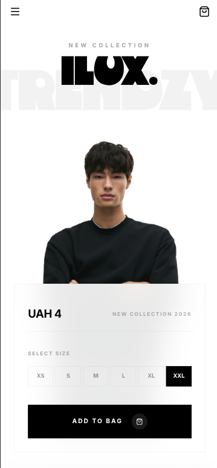

<h1 align="center" > E-Commerce Frontend React </h1>

<div align="center">
A modern, responsive e-commerce frontend application built with React, Vite, and Tailwind CSS.


</div>

## 📸 Screenshots

### 💻 Desktop View


<div align="center">
  <table border="0">
    <tr>
      <td width="50%" align="center">
        <h4>📱 Mobile View</h4>
        
      </td>
      <td width="50%" align="center">
        <h4>📟 Tablet View</h4>
        
      </td>
    </tr>
  </table>
</div>

## 📋 Table of Contents

- [Features](#features)
- [Tech Stack](#tech-stack)
- [Prerequisites](#prerequisites)
- [Installation](#installation)
- [Running the Application](#running-the-application)
- [Project Structure](#project-structure)
- [Available Scripts](#available-scripts)
- [Key Dependencies](#key-dependencies)
- [Contributing](#contributing)
- [License](#license)

## ✨ Features

### User Interface

- 🛒 **Modern E-commerce Design** - Clean, elegant interface inspired by premium fashion brands
- 📱 **Fully Responsive** - Seamless experience across mobile, tablet, and desktop devices
- 🎨 **Hero Sections** - Eye-catching hero banners with "Timeless Elegance" branding
- 🔝 **Intuitive Navigation** - Easy-to-use navigation with Products, Categories, and Customer Support sections
- 🍔 **Mobile-First** - Hamburger menu for mobile devices with smooth interactions

### Technical Features

- ⚡ **Lightning-Fast Performance** - Powered by Vite for instant hot module replacement
- 📝 **Form Validation** - Robust form handling with React Hook Form and Yup schemas
- 🔄 **Client-Side Routing** - Smooth navigation with React Router DOM
- 🎯 **API Integration** - Type-safe API calls with Axios
- 🎨 **Lucide Icons** - Beautiful, consistent iconography throughout the app
- 🎨 **Tailwind CSS** - Utility-first styling for rapid UI development

### User Experience

- 🔐 **Authentication** - Sign In and Sign Up functionality
- 🛍️ **Product Collections** - Browse curated collections with "Explore Collection" feature
- 📖 **Lookbook** - "View Lookbook" feature for style inspiration
- 💼 **Premium Branding** - Sophisticated design emphasizing quality and comfort

## 🛠 Tech Stack

- **Framework**: React 19.1.1
- **Build Tool**: Vite 7.1.6
- **Styling**: Tailwind CSS 4.1.13
- **Routing**: React Router DOM 7.9.1
- **Form Management**: React Hook Form 7.63.0
- **Validation**: Yup 1.7.0
- **HTTP Client**: Axios 1.12.2
- **Icons**: Lucide React 0.544.0

## 📦 Prerequisites

Before you begin, ensure you have the following installed:

- **Node.js** (v18 or higher)
- **npm** (v9 or higher) or **yarn**
- **Git**

## 🚀 Installation

1. **Clone the repository**

```bash
git clone https://github.com/javaadde/ecommerce-frontend-react.git
cd ecommerce-frontend-react
```

2. **Install dependencies**

```bash
npm install
```

or if you're using yarn:

```bash
yarn install
```

3. **Environment Setup**

Create a `.env` file in the root directory and add your environment variables:

```env
VITE_API_BASE_URL=your_api_url_here
```

## 🏃 Running the Application

### Development Mode

Start the development server with hot-reload:

```bash
npm run dev
```

The application will be available at `http://localhost:5173`

### Production Build

Build the application for production:

```bash
npm run build
```

### Preview Production Build

Preview the production build locally:

```bash
npm run preview
```

### Linting

Run ESLint to check code quality:

```bash
npm run lint
```

## 📁 Project Structure

```
ecommerce-frontend-react/
├── public/              # Static assets
├── src/
│   ├── assets/         # Images, fonts, etc.
│   ├── components/     # Reusable components
│   │   ├── Header/    # Navigation header component
│   │   ├── Hero/      # Hero banner component
│   │   └── ...
│   ├── pages/          # Page components
│   │   ├── Home/      # Landing page
│   │   ├── Products/  # Products listing
│   │   ├── Auth/      # Sign In / Sign Up
│   │   └── ...
│   ├── hooks/          # Custom React hooks
│   ├── services/       # API services
│   ├── utils/          # Utility functions
│   ├── App.jsx         # Main App component
│   └── main.jsx        # Application entry point
├── .eslintrc.cjs       # ESLint configuration
├── index.html          # HTML template
├── package.json        # Project dependencies
├── tailwind.config.js  # Tailwind configuration
└── vite.config.js      # Vite configuration
```

## 🎨 Design System

The application follows a consistent design language:

- **Color Palette**: Neutral tones with black accents for premium feel
- **Typography**: Clean, modern fonts with "TIMELESS ELEGANCE" branding
- **Layout**: Spacious, minimalist design with focus on product imagery
- **Components**: Reusable button styles (primary black, secondary outlined)
- **Responsive Breakpoints**: Mobile-first approach with tablet and desktop variants

## 📜 Available Scripts

| Script            | Description              |
| ----------------- | ------------------------ |
| `npm run dev`     | Start development server |
| `npm run build`   | Build for production     |
| `npm run preview` | Preview production build |
| `npm run lint`    | Run ESLint               |

## 🔑 Key Dependencies

### Core Dependencies

- **React & React DOM**: UI library for building user interfaces
- **React Router DOM**: Declarative routing for React applications
- **Axios**: Promise-based HTTP client for API requests
- **React Hook Form**: Performant, flexible form validation
- **Yup**: Schema validation for form inputs
- **Tailwind CSS**: Utility-first CSS framework
- **Lucide React**: Beautiful & consistent icon toolkit
- **Object to FormData**: Convert JavaScript objects to FormData

### Dev Dependencies

- **Vite**: Next-generation frontend tooling
- **ESLint**: Code linting and quality checks
- **@vitejs/plugin-react**: React support for Vite

## 🤝 Contributing

Contributions are welcome! Please follow these steps:

1. Fork the repository
2. Create a new branch (`git checkout -b feature/amazing-feature`)
3. Commit your changes (`git commit -m 'Add some amazing feature'`)
4. Push to the branch (`git push origin feature/amazing-feature`)
5. Open a Pull Request

## 📝 License

This project is licensed under the MIT License - see the [LICENSE](LICENSE) file for details.

## 👨‍💻 Author

**Javaadde**

- GitHub: [@javaadde](https://github.com/javaadde)

## 🙏 Acknowledgments

- React team for the amazing framework
- Vite team for the blazing-fast build tool
- Tailwind CSS for the utility-first CSS framework
- All contributors who help improve this project

---

Made with ❤️ by [Javaadde](https://github.com/javaadde)
